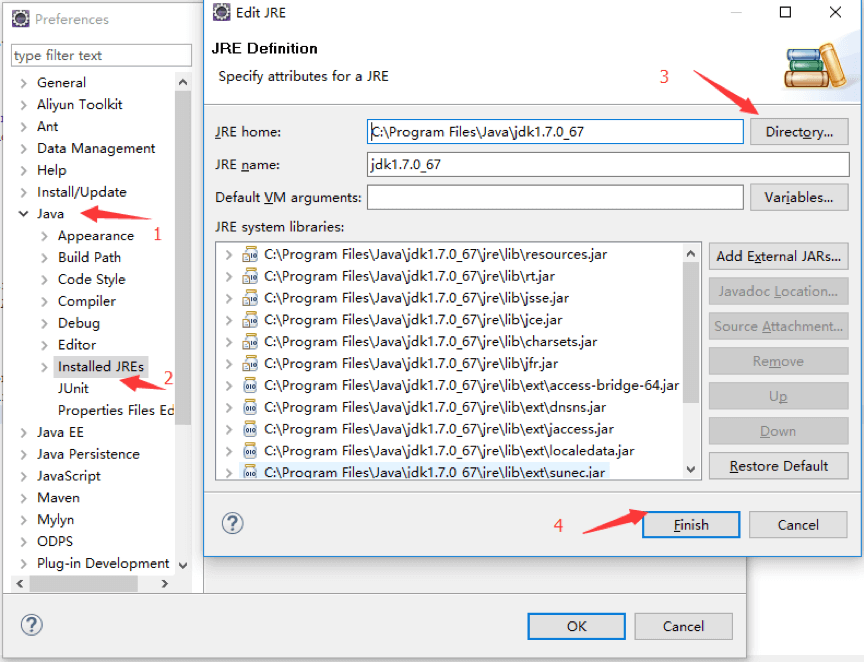
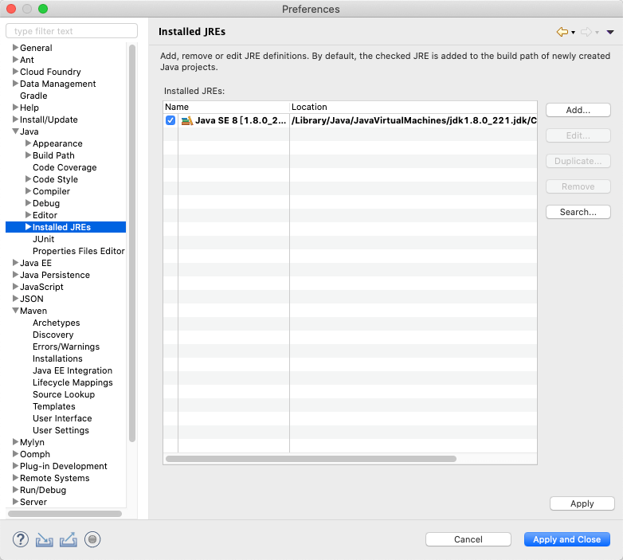
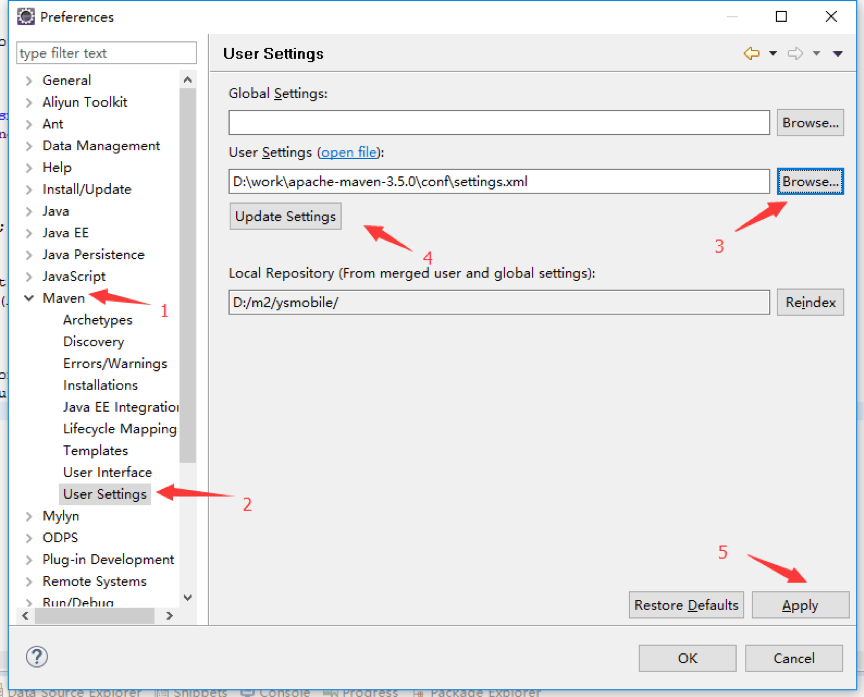
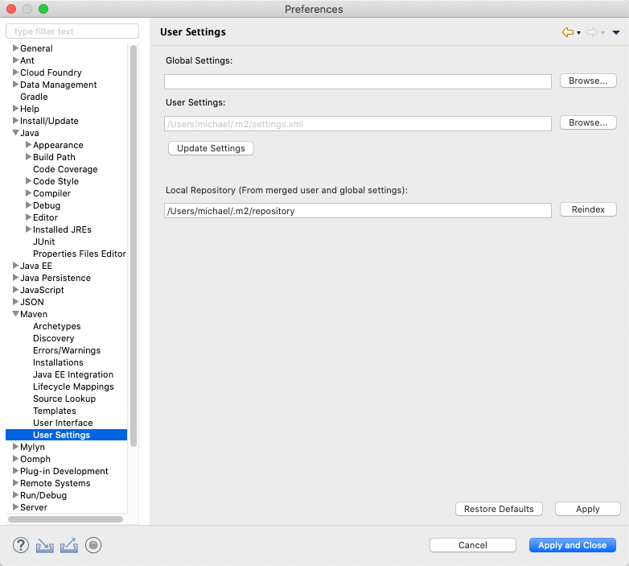
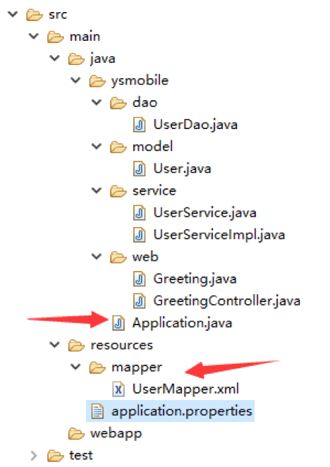
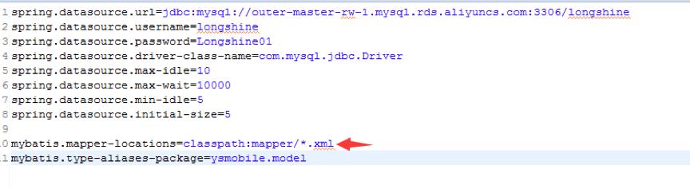
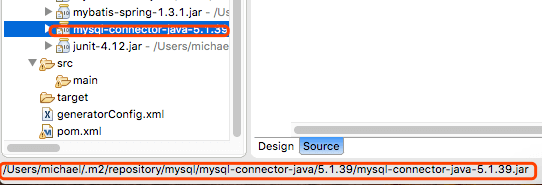
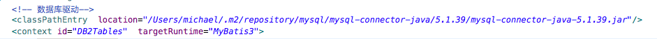
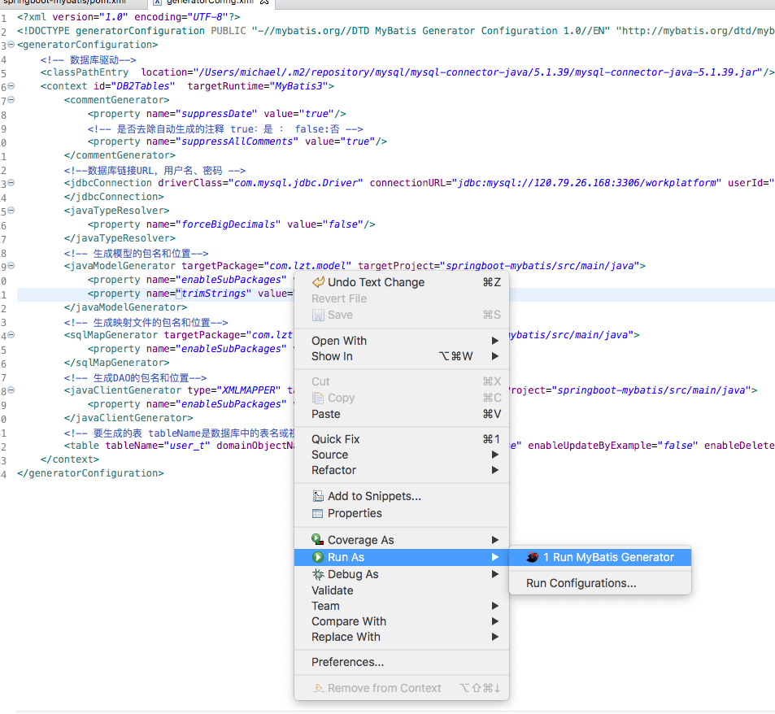
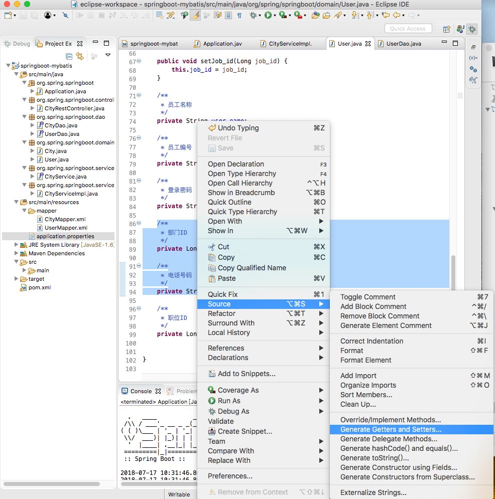

# 目录
1. [介绍](#介绍) 
2. [环境搭建](#环境搭建)
    * [安装 Java](#安装Java)
    * [安装 Maven](#安装Maven)
    * [安装 Eclipse](#安装Eclipse)
    * [生成 Spring Boot 项目](#生成SpringBoot项目)
    * [集成 Mybatis](#集成Mybatis)
    * [其他事项](#其他事项)
3. [开发步骤](#开发步骤)
    * [配置数据库](#配置数据库)
    * [新增实体类 model](#新增实体类model)
    * [定义 dao 层](#定义dao层)
    * [编写 controller 控制层](#编写controller控制层)
    * [编写 service 业务逻辑层](#编写service业务逻辑层)
    * [打包发布](#打包发布)

# <a name="介绍">介绍</a>
本项目是基于 JDK 1.8 & MAVEN 3.6.2 & Eclipse Luna 及以上，构建的管理平台服务端

# <a name="环境搭建">环境搭建</a>  
## <a name="安装Java">安装 Java</a>  
自行下载，并配置环境变量

## <a name="安装Maven">安装 Maven</a>  
[下载地址](http://maven.apache.org/download.cgi)

**配置环境变量**
```bash
vim .zshrc
129 # Set Maven path
130 export M2_HOME=$HOME/apache-maven-3.6.2
131 export PATH=$PATH:$M2_HOME/bin
```  

**配置镜像**
```bash
vim /Users/michael/apache-maven-3.6.2/conf/settings.xml

159     <mirror>
160       <id>alimaven</id>
161       <name>aliyun maven</name>
162       <url>https://maven.aliyun.com/nexus/content/groups/public/</url>
163     </mirror>
```  
## <a name="安装Eclipse">安装 Eclipse</a>  
[下载地址](https://www.eclipse.org/downloads/)  
打开 Eclipse，点击 Eclipse/Window -> Preferences，在 Java 选项里面配置 JDK，如图：  

  

 

在 Maven 选项里面配置 User Settings ，如图：  

  

  

## <a name="生成SpringBoot项目">生成 Spring Boot 项目</a>  
1. 在 File -> New 里面选择 Maven Project，选中后出现了新的对话框，勾选 Create a simple project (skip archetype selection)，然后下一步，填写自己定义的相关 ID，最后点击 Finish
2. 在新生成的项目中，编辑 [pom.xml](pom.xml) 文件，在其中增加 `spring-boot-starter-parent` 作为 parent，并依赖 `spring-boot-starter-web` 和 `maven-resources-plugin`，详见文件[pom.xml](pom.xml)。XML 中其它部分内容在下文中会用到，保存后，等 Maven 相关依赖包下载完成后，在[Application.java](src/main/java/org/spring/springboot/Application.java) 文件中编写 web 应用初始化程序，其中 `@SpringBootApplication` 注解会告诉 Spring 去扫描类路径，初始化 Spring Context 以及启动内嵌 Tomcat 容器等一系列操作。main 函数用于启动 Spring Boot 程序，只要右键 Application.java 文件，弹出菜单 Run as...，选中 Java Application 即可运行 Spring Boot。当 Spring Boot 启动完成后，只需要在地址栏输入 http://localhost:8080，就能够看到 Hello World!出现在浏览器中。

## <a name="集成Mybatis">集成 Mybatis</a>  
首先在 [pom.xml](pom.xml) 中引入 mybatis 相关依赖包：  
```xml
<dependency>
	    <groupId>org.mybatis.spring.boot</groupId>
	    <artifactId>mybatis-spring-boot-starter</artifactId>
	    <version>1.2.0</version>
	</dependency>
	<dependency>
        <groupId>mysql</groupId>
        <artifactId>mysql-connector-java</artifactId>
</dependency>
```  

接着按照 Spring MVC 结构实现 dao、service、model 和 controller 层，目录结构如下：  

    

> 请注意 [Application.java](src/main/java/org/spring/springboot/Application.java) 文件的目录位置，必须位于项目包的下一级目录，不能在下级包里面，这是因为`@SpringBootApplication` 注解是扫描当前包层级及下级，所以需要讲该文件放置在顶级目录中，同时要在文件中增加 Mapper 扫描：`@MapperScan(basePackages = "org.spring.springboot.dao") ` 

最后需要在 [resources](src\main\resources) 下面创建 [](src/main/resources/) 文件，里面用于定义数据源配置，以及 mybatis 扫描的 xml 路径。如下：  

   

> 请注意 xml 路径定义，和前图中标记的 xml 位置是相关的

## 其他事项
**权限控制**  
通过 Spring Security 实现权限控制，拦截请求（可配置）到相应登录页面，登录成功后才能调用接口

**开启SQL日志输出** 
```bash
vim src/main/resources/application.properties

mybatis.mapper-locations=classpath:mapper/**/*.xml // 对应所有xml
mybatis.type-aliases-package=workplatform.model // 对应所有model
mybatis.configuration.log-impl=org.apache.ibatis.logging.stdout.StdOutImpl 

#myabtis sql info
logging.level.workplatform.dao=DEBUG
```  

# <a name="开发步骤">开发步骤</a>  
## <a name="配置数据库">配置数据库</a>  
**配置数据库驱动**  

  

  

```bash
vim generatorConfig.xml

<?xml version="1.0" encoding="UTF-8"?>
<!DOCTYPE generatorConfiguration PUBLIC "-//mybatis.org//DTD MyBatis Generator Configuration 1.0//EN" "http://mybatis.org/dtd/mybatis-generator-config_1_0.dtd">
<generatorConfiguration>  
    <!-- 数据库驱动-->    
    <classPathEntry  location="/Users/michael/.m2/repository/mysql/mysql-connector-java/5.1.39/mysql-connector-java-5.1.39.jar"/>    
    <context id="DB2Tables"  targetRuntime="MyBatis3">    
        <commentGenerator>    
            <property name="suppressDate" value="true"/>    
            <!-- 是否去除自动生成的注释 true：是 ： false:否 -->    
            <property name="suppressAllComments" value="true"/>    
        </commentGenerator>    
        <!--数据库链接URL，用户名、密码 -->    
        <jdbcConnection driverClass="com.mysql.jdbc.Driver" connectionURL="jdbc:mysql://120.79.26.168:3306/workplatform" userId="root" password="Tdreamer2018">    
        </jdbcConnection>    
        <javaTypeResolver>    
            <property name="forceBigDecimals" value="false"/>    
        </javaTypeResolver>    
        <!-- 生成模型的包名和位置-->    
        <javaModelGenerator targetPackage="com.lzt.model" targetProject="springboot-mybatis/src/main/java">    
            <property name="enableSubPackages" value="true"/>    
            <property name="trimStrings" value="true"/>    
        </javaModelGenerator>    
        <!-- 生成映射文件的包名和位置-->    
        <sqlMapGenerator targetPackage="com.lzt.mapping" targetProject="springboot-mybatis/src/main/java">    
            <property name="enableSubPackages" value="true"/>    
        </sqlMapGenerator>    
        <!-- 生成DAO的包名和位置-->    
        <javaClientGenerator type="XMLMAPPER" targetPackage="com.lzt.mapper" targetProject="springboot-mybatis/src/main/java">    
            <property name="enableSubPackages" value="true"/>    
        </javaClientGenerator>    
        <!-- 要生成的表 tableName是数据库中的表名或视图名 domainObjectName是实体类名-->    
        <table tableName="user_t" domainObjectName="User" enableCountByExample="false" enableUpdateByExample="false" enableDeleteByExample="false" enableSelectByExample="false" selectByExampleQueryId="false"></table>  
    </context>    
</generatorConfiguration>
```

  

生成后的 src/main/java/com.user.mapping 里的文件要放到 src/main/resources/mapper/ 下面，否则启动报错

**配置数据库地址账号密码**  

```bash
vim src/main/resources/
# 主数据源
spring.datasource.url=jdbc:mysql://127.0.0.1:3306/datebase-name?useUnicode=true&characterEncoding=utf8&useSSL=false
spring.datasource.username=root
spring.datasource.password=password
spring.datasource.driver-class-name=com.mysql.jdbc.Driver
```  

## <a name="新增实体类model">新增实体类 model</a>  
便于增删改查，不用一个一个的声明  
```bash
vim src/main/java/org/spring/springboot/domain/City.java
```  
可以通过右键，让声明自动生成 get/set 方法，如下：  

  

## <a name="定义dao层">定义 dao 层</a>  
定义所有接口方法，不需要实现，框架默认生成  
```bash
vim /src/main/java/org/spring/springboot/dao/CityDao.java
```  

## <a name="编写sql">编写 sql</a>  
每个 sql 的 id 对应 dao 层，且不能重复，通过命名空间使用  
```bash
vim src/main/resources/mapper/CityMapper.xml
```  
Mapper 接口开发需要遵循以下规范：
* mapper 目录中 .xml 文件的 namespace 与 mapper 接口的类路径相同
* mapper 接口方法名和 .xml 中定义的每个 statement 的 id 相同
* mapper 接口方法的输入参数类型和 mapper.xml 中定义的每个 sql 的 parameterType 的类型相同
* mapper 接口方法的输出参数类型和 mapper.xml 中定义的每个 sql 的 resultType 的类型相同  

## <a name="编写service业务逻辑层">编写 service 业务逻辑层</a>  
接口和实现类中的方法一一对应：  
* 接口：[src/main/java/org/spring/springboot/service/CityService.java](src/main/java/org/spring/springboot/service/CityService.java)
* 实现类：[src/main/java/org/spring/springboot/service/impl/CityServiceImpl.java](src/main/java/org/spring/springboot/service/impl/CityServiceImpl.java)

## <a name="编写controller控制层">编写 controller 控制层</a>  
负责相应前端请求，方法在 Service 业务逻辑层实现   
```bash
vim src/main/java/org/spring/springboot/controller/CityRestController.java
```

## <a name="打包发布">打包发布</a>  
在 [pom.xml](pom.xml) 文件中，增加打 war 包相关配置：`<packaging>war</packaging>`，增加 Tomcat 运行时的依赖包及 JDK 配置：  
```xml
<dependency>
        <groupId>org.springframework.boot</groupId>
        <artifactId>spring-boot-starter-tomcat</artifactId>
        <scope>provided</scope>
	</dependency>

	<properties>
      <java.version>1.7</java.version>
  </properties>
  
  <build>
      <plugins>
          <plugin>
              <groupId>org.springframework.boot</groupId>
              <artifactId>spring-boot-maven-plugin</artifactId>
          </plugin>
      </plugins>
  </build>
```  

然后需要在 [Application.java](src/main/java/org/spring/springboot/Application.java) 文件中，增加方法：  
```java
@Override
    protected SpringApplicationBuilder configure(SpringApplicationBuilder application) {
        return application.sources(Application.class);
}
```  

最后再通过 `mvn clean package` 命令打包成 war 包，上传到 gitlab 上，自动部署到 Tomcat 上即可。  